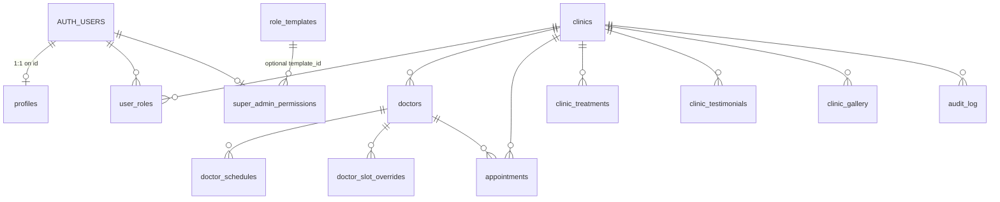

# ClinicFlow — Application Blueprint

A single-source reference for the entire app: architecture, every route, every server function, the full database schema, security posture, and operational conventions. Read this file end-to-end to understand how the system fits together.

---

## 1. Overview

ClinicFlow is a multi-tenant SaaS for Indian doctors, clinics, and hospitals. It provides:

- **Public marketing site** per clinic at `/{slug}` with treatments, doctors, gallery, testimonials, and an enquiry form.
- **Online booking** for patients via phone-OTP, with overlap-free slot allocation.
- **Clinic manager portal** at `/{slug}/clinicmanager` to manage doctors, schedules, appointments, page content, gallery, testimonials, and team.
- **Super-admin console** at `/superadmin` to provision clinics, manage subscriptions, audit activity, monitor health, and administer users.

**User types**
1. **Visitors / patients** — anonymous; can browse clinics, submit enquiries, and book via OTP.
2. **Clinic staff** — `clinic_user` (read) and `clinic_manager` (write) roles, scoped per clinic.
3. **Super admins** — platform operators with permission flags (dashboard, clinics, doctors, …).

**Tenancy model.** Every tenant row carries `clinic_id`. Membership is in `public.user_roles(user_id, clinic_id, role)`. A super admin has a row with `clinic_id = NULL` and `role = 'super_admin'`. Postgres RLS — not application code — is the source of truth for isolation.

---

## 2. Tech Stack

| Layer | Tech |
| --- | --- |
| Frontend | React 19, TanStack Router/Start, TanStack Query, Tailwind CSS v4, shadcn/ui (Radix), lucide-react |
| Build / runtime | Vite 7, Cloudflare Workers (`workerd`) with `nodejs_compat`, SSR |
| Backend | Supabase (Postgres + Auth + Storage + Realtime) |
| Validation | Zod on every server function input |
| SMS | Pluggable provider (`dev` / `twilio` / `msg91` / `gupshup`) |
| Email | Resend + `@react-email/components` (transactional templates) |
| WhatsApp | Interakt (Meta WhatsApp Business approved templates) |

---

## 3. High-Level Architecture

```
            Browser (React 19, TanStack Router)
                │   ▲
                │   │ HeadContent / Outlet / Link
                ▼   │
        ┌──────────────────────┐
        │  TanStack Start SSR  │  (Cloudflare Workers + nodejs_compat)
        └──────────────────────┘
            │           │
            │           └──── /api/public/*  → server route handlers
            │
            ▼
   createServerFn (RPC)
            │
            │  attachSupabaseAuth   ← global functionMiddleware: forwards user JWT
            │  requireSupabaseAuth  ← per-fn middleware: enforces session
            ▼
   Supabase client (one of three):
     • browser            — anon key, used for auth & realtime
     • auth-middleware    — anon key + user JWT, RLS applied as caller
     • client.server      — service role (handler-local dynamic import only)
            │
            ▼
   Postgres (RLS-protected) · Storage (3 public buckets) · Auth
```

- **Server functions** (`src/lib/**/*.functions.ts`) — typed RPC; transformed by TanStack so handler bodies never ship to the browser.
- **Server routes** (`src/routes/api/**`) — none currently defined; OTP, enquiries, etc. are all server fns. The `/api/public/*` namespace is reserved for future webhooks.
- **Three Supabase clients**:
  1. `src/integrations/supabase/client.ts` — browser client; localStorage session persistence; used for auth listeners, sign-in/out, realtime channels.
  2. `src/integrations/supabase/auth-middleware.ts` — exports `requireSupabaseAuth`; builds a per-request Supabase client carrying the caller's bearer token so RLS applies as that user.
  3. `src/integrations/supabase/client.server.ts` — service role client; **only loaded via `await import()` inside handlers** after authorization; never at module scope of a route or `.functions.ts` file.

---

## 4. Bootstrap & Entry

| File | Purpose |
| --- | --- |
| `src/start.ts` | `createStart({ requestMiddleware: [errorMiddleware], functionMiddleware: [attachSupabaseAuth] })`. `errorMiddleware` renders the branded error page on 5xx; `attachSupabaseAuth` attaches `Authorization: Bearer <jwt>` to every outgoing server-fn call. |
| `src/router.tsx` | Creates a per-request `QueryClient` (`staleTime: 60_000`, `gcTime: 300_000`, `retry: 1`, `refetchOnWindowFocus: false`), instantiates the router with `scrollRestoration`, `defaultPreloadStaleTime: 0`, and inline `defaultErrorComponent` / `defaultNotFoundComponent`. |
| `src/routes/__root.tsx` | Root layout — `HeadContent`, `Scripts`, global `<Toaster />`, `QueryClientProvider`, `UiV2Bootstrap`, sets up `supabase.auth.onAuthStateChange` to invalidate the router on sign-in/out, and renders site-wide head meta. |
| `src/routes/_authenticated.tsx` | Auth gate layout — redirects to `/login` when there is no session, renders a top bar (super-admin link, "My clinics" link, sign-out), and `<Outlet />` for nested authed pages. |
| `src/lib/rememberMe.ts` | Rehydrates a sessionStorage-stashed token into localStorage before the Supabase client touches storage (supports "remember me" toggle). |

---

## 5. Routes — Complete Map

> File-based routing under `src/routes/`. Dots in filenames map to slashes. Routes prefixed `_authenticated` require a session.

### 5.1 Public site

| URL | File | Auth | Purpose |
| --- | --- | --- | --- |
| `/` | `routes/index.tsx` | none | Marketing landing page (ClinicFlow platform). |
| `/login` | `routes/login.tsx` | none | Email/password login + Google OAuth + clinic-manager helper. |
| `/{slug}` | `routes/$slug.tsx` | none | Public clinic landing page. Renders `ClinicLanding` (or v2 variant) with treatments, doctors, gallery, testimonials, enquiry form, booking dialog. Sets per-clinic head meta (title, description, og:image=cover). Handles `ClinicInactive` / `ClinicExpired` states. |
| `/{slug}/doctors/{doctorId}` | `routes/$slug.doctors.$doctorId.tsx` | none | Public doctor profile page with biography, languages, availability summary, booking entry point. |
| `/superadmin/login` | `routes/superadmin.login.tsx` | none | Super-admin sign-in. If no super admin exists, exposes the one-shot **bootstrap** flow gated to the pinned email. |
| `/superadmin/logout` | `routes/superadmin.logout.tsx` | none | Performs sign-out then redirects. |
| `/privacy` | `routes/privacy.tsx` | none | Privacy policy (static legal page; linked from `LandingFooter`). |
| `/terms` | `routes/terms.tsx` | none | Terms of service (static legal page; linked from `LandingFooter`). |

### 5.2 Clinic-manager portal (per-clinic; auth + role gated in component)

| URL | File | Auth | Purpose |
| --- | --- | --- | --- |
| `/{slug}/clinicmanager` | `routes/$slug_.clinicmanager.tsx` | session + `clinic_manager` or super admin | Manager dashboard shell. Tabbed sections: Overview, Profile, Working Hours, Doctors, Treatments, Testimonials, Gallery, Cover, Team, Appointments, Stats, Settings, Media Library. |
| `/{slug}/clinicmanager/doctors/{doctorId}` | `routes/$slug_.clinicmanager.doctors.$doctorId.tsx` | session + manager | Per-doctor management page: profile, weekly schedule, slot overrides, recent appointments. |
| `/clinicmanager` | `routes/clinicmanager.tsx` | none | Generic clinic-manager landing/login helper (deep link entry). |

### 5.3 Authenticated app

| URL | File | Auth | Purpose |
| --- | --- | --- | --- |
| `/app` | `routes/_authenticated/app.tsx` | session | "My clinics" picker — lists clinics the user manages or belongs to and links to their manager pages. |
| `/{slug}/manage` | `routes/_authenticated/$slug.manage.tsx` | session | Alternative authed entry for managing a clinic by slug. |

### 5.4 Super-admin console

| URL | File | Auth | Purpose |
| --- | --- | --- | --- |
| `/superadmin` | `routes/superadmin.index.tsx` + `components/SuperAdminLayout.tsx` | session + `super_admin` + permission flags | Tabbed admin console hosting all views below. |

**Sub-views** (all in `src/components/superadmin/views/`, mounted inside `SuperAdminLayout`, individually gated by `super_admin_permissions.*`):

| Tab | Component | Gating flag | Purpose |
| --- | --- | --- | --- |
| Dashboard | `DashboardView.tsx` | `can_dashboard` | KPI tiles, recent activity, system alerts. |
| Clinics | `ClinicsView.tsx` + `AddClinicWizard.tsx` + `EditClinicDialog.tsx` | `can_clinics` | Paginated list (25/page), filters, CRUD, activation toggle. |
| Doctors | `DoctorsView.tsx` | `can_doctors` | Cross-clinic doctor listing (paginated). |
| Appointments | `AppointmentsView.tsx` | `can_appointments` | Cross-clinic appointments with clinic / status / date filters (server paginated 25/page). |
| Clinic Settings | `ClinicSettingsView.tsx` | `can_clinic_settings` | Per-clinic SMS/notification overrides. |
| Enquiries | `EnquiriesView.tsx` + `EnquiryStatusBadge.tsx` | `can_enquiries` | Lead pipeline with status workflow. |
| Customers | `CustomersView.tsx` | `can_customers` | All clinic-manager accounts. |
| Subscriptions | `SubscriptionsView.tsx` + `EditSubscriptionDialog.tsx` | `can_subscriptions` | Plan + trial/expiry management. |
| Users | `UsersView.tsx` / `SystemUsersView.tsx` | `can_users` | Add/edit/disable super-admin team. |
| User Roles | `UserRolesView.tsx` + `PermissionGrid.tsx` | `can_user_roles` | Role-template editor (system + custom). |
| Audit | `AuditView.tsx` | `can_audit` | Audit log viewer (paginated). |
| Monitoring | `MonitoringView.tsx` | `can_monitoring` | Live alerts + signup/booking counters. |
| Profile | `ProfileView.tsx` | self | Current admin's profile + password. |
| Settings | `SettingsView.tsx` | `can_dashboard` | Platform-wide settings (SMS provider, notification defaults). |

### 5.5 API / server routes

Only `routes/api/public/health.ts` (lightweight liveness probe). The `/api/public/*` namespace is reserved for future webhook or cron endpoints (must verify HMAC signatures and load `client.server` inside the handler).

---

## 6. Server Functions Catalog

All functions live under `src/lib/*.functions.ts`. Every authenticated function uses `.middleware([requireSupabaseAuth])` and validates input with Zod. `attachSupabaseAuth` (global) forwards the bearer token from the browser; service-role usage is dynamically imported inside the handler **only after** authorization.

### 6.1 `public.functions.ts` — anonymous/public surface

| Export | Method | Auth | Purpose |
| --- | --- | --- | --- |
| `getClinicBySlug` | GET | public | Active-clinic lookup by slug (RLS allows anon read for marketing). |
| `getClinicPageContent` | GET | public | Returns treatments + testimonials + gallery for a clinic. |
| `getDoctorsForClinic` | GET | public | Public list of active doctors. |
| `getPublicDoctorProfile` | GET | public | Single doctor's public profile + clinic envelope. |
| `getAvailableSlots` | GET | public | Computes bookable slots for a doctor on a date: weekly `doctor_schedules` ∩ `doctor_slot_overrides` minus active appointments (GiST exclusion guarantees non-overlap on insert). |
| `requestPatientOtp` | POST | public + IP rate-limit | Generates 6-digit OTP, hashes it, stores `patient_otp` row, dispatches via configured SMS provider. For `provider === "dev"` only, returns the code as `devCode` for testing. |
| `verifyPatientOtp` | POST | public + IP rate-limit | Validates code, increments attempts, marks consumed. |
| `createAppointment` | POST | public (OTP-gated) + IP rate-limit | Inserts an appointment after OTP verification; GiST exclusion enforces no overlap server-side. |

### 6.2 `enquiries.functions.ts`

| Export | Method | Auth | Purpose |
| --- | --- | --- | --- |
| `createEnquiry` | POST | public + IP rate-limit | Insert with `status='new'` (matches RLS WITH CHECK). |
| `listEnquiries` | POST | super admin | Paginated list. |
| `updateEnquiryStatus` | POST | super admin | Status workflow + `assigned_to`. |

### 6.3 `superadmin.functions.ts`

Authentication: `getSignupStatus` is public (returns `{ bootstrapMode: boolean }` only — no email). `bootstrapFirstSuperAdmin` is public **once**: the SQL function enforces zero-existing-super-admins AND the pinned email. All other functions require `requireSupabaseAuth` plus `assertSuperAdmin` (which also enforces `is_disabled = false`).

Functions: `getSignupStatus`, `bootstrapFirstSuperAdmin`, `checkSlugAvailable`, `createClinic`, `updateClinic`, `listClinicManagers`, `setClinicManagerPassword`, `listAllCustomers`, `setClinicActive`, `updateClinicSubscription`, `deleteClinic`, `listClinicsForSuperAdmin`, `listSystemUsers`, `addSystemUser`, `updateSystemUserPermissions`, `setSystemUserDisabled`, `resetSystemUserPassword`, `updateMyProfile`, `getMyProfile`, `listRoleTemplates`, `saveRoleTemplate`, `deleteRoleTemplate`, `getSmsSettings`, `updateSmsSettings`, `sendTestSms`.

### 6.4 `clinicmanager.functions.ts`

Authentication: `assertClinicAccess` (super admin or clinic_manager for that clinic).

Functions: `getManagerDashboard`, `updateClinicProfile`, `updateClinicWorkingHours`, `upsertDoctor`, `deleteDoctor`, `updateDoctorInterval`, `listClinicMembers`, `addClinicUser`, `removeClinicUser`. Doctor list capped at 200.

### 6.5 `pagecontent.functions.ts`

All gated to clinic_manager / super admin. List functions are capped server-side at 25 rows (`.range(0, 24)`).

Functions: `updateClinicCover`, `updateClinicStats`, `listTreatments`, `upsertTreatment`, `deleteTreatment`, `listTestimonials`, `upsertTestimonial`, `deleteTestimonial`, `listGallery`, `addGalleryImage`, `deleteGalleryImage`.

### 6.6 `media.functions.ts`

`listClinicMedia`, `deleteClinicMedia` — manager + super admin only.

### 6.7 `dashboard.functions.ts`

`getSuperAdminDashboard`, `getSuperAdminMonitoring`, `getClinicManagerDashboard`, `listSuperAdminAlerts`, `resolveSystemAlert`, `listClinicsSummary`, `listEnquiriesAdmin`. All authenticated; super-admin endpoints assert role + permission flags.

### 6.8 `notifications/` (module)

The notifications subsystem lives under `src/lib/notifications/` and funnels every outbound message through a single **dispatcher** (`dispatcher.server.ts`, server-only). No template, trigger point, or component sends directly.

**Six-tier precedence** (each gate must pass; first failure short-circuits and is logged):

1. **Platform** — `platform_settings.notifications.enabled` master switch.
2. **Clinic** — per-clinic master toggle (`clinics.notify_email/sms/whatsapp`).
3. **Event** — per-event toggle on `clinics.notify_patient_<event>_<channel>` (8 columns: `_sms`, `_whatsapp`, `_email`, `_email_clinic` for the two patient-facing events).
4. **Provider** — provider configured + enabled in `platform_settings.{sms,whatsapp,email}.provider` with valid credentials.
5. **Recipient** — channel-specific recipient present (phone for SMS/WhatsApp, email for Email).
6. **Masking** — `maskPhone` / `maskEmail` from `mask.ts` applied to every value that reaches a provider payload, template variable, or `notification_log` row.

**Five trigger events**: `appointment_booked`, `appointment_rescheduled`, `clinic_new_booking` (to clinic staff), `new_clinic_welcome`, `subscription_expiry`.

**Adapters** (`providers/`): `msg91.server.ts` (transactional SMS, Flow API), `interakt.server.ts` (WhatsApp Business templates), `resend.server.ts` (transactional email).

**Templates** (`templates/`): SMS + WhatsApp template maps (`sms/index.ts`, `whatsapp/index.ts`) and React Email components under `templates/email/` (`AppointmentBookedEmail`, `AppointmentRescheduledEmail`, `ClinicNewBookingEmail`, `NewClinicWelcomeEmail`, `SubscriptionExpiryEmail`).

**Helpers**: `mask.ts` (`maskPhone` → `XXXXX<last5>`; `maskEmail` → `xx***@domain`), `types.ts` (shared event + payload types). All dispatcher inputs and template data flow through `sanitiseTemplateData` so a raw 10/12-digit phone cannot leak via `templateData` keys.

**Server functions** (`notifications.functions.ts`, super-admin only): list/update `platform_settings` blocks, send test message per channel, list `notification_log` with masked search by last-5 digits. The dispatcher itself is not exposed as an RPC — it's imported by other server fns (`createAppointment`, reschedule, clinic creation, expiry cron) only.

---

## 7. Database Blueprint

### 7.1 Schema overview



### 7.2 Enums

- `app_role` = `super_admin | clinic_manager | clinic_user`
- `appointment_status` = `pending | confirmed | rescheduled | cancelled | completed`

### 7.3 Tables (per-table reference)

> Every table has RLS enabled. Grants follow the standard pattern: `service_role` ALL; `authenticated` SELECT/INSERT/UPDATE/DELETE on tenant tables; `anon` SELECT only on the marketing tables that have a `public read` policy.

#### profiles
1:1 with `auth.users`. Mirrored on signup by `handle_new_user()` trigger.

| Column | Type | Notes |
| --- | --- | --- |
| `id` | uuid PK | FK `auth.users(id) ON DELETE CASCADE` |
| `full_name` | text |  |
| `phone` | text |  |
| `created_at` | timestamptz |  |

**Policies**: `profiles self read` (SELECT, `id = auth.uid()`), `profiles self update` (UPDATE, both USING + WITH CHECK = `id = auth.uid()`), `profiles super admin read` (SELECT, `has_role(auth.uid(),'super_admin')`).

#### user_roles
Role membership; (user_id, clinic_id, role) unique. `clinic_id` NULL for `super_admin`.

**Policies**:
- `user_roles self read` (SELECT) — `user_id = auth.uid()`
- `user_roles super admin all` (ALL) — `has_role(...,'super_admin')` USING + WITH CHECK
- `user_roles manager read clinic` (SELECT) — `clinic_id IS NOT NULL AND has_clinic_role(...,'clinic_manager')`
- `user_roles manager add clinic_user` (INSERT) — WITH CHECK: clinic set, role=`clinic_user`, manager owns clinic
- `user_roles manager delete clinic_user` (DELETE) — same constraint

Indexes: `(user_id, role)`, `(clinic_id, role)`.

#### super_admin_permissions
Per-super-admin permission flags + `is_disabled` kill-switch + optional `role_template_id`.

**Columns**: `user_id PK`, twelve `can_*` booleans, `phone`, `role_template_id`, `is_disabled`, `created_at`, `updated_at`.

**Policies**: `sa_perms self read` (SELECT, self OR super admin), `sa_perms super admin all` (ALL, super admin). Trigger `touch_updated_at` on UPDATE.

#### role_templates
Reusable permission presets (system + custom). System rows are immutable via `protect_system_role_templates()` trigger.

**Policies**: `role_templates super admin all` (ALL, super admin).

#### clinics
Tenant root. 33+ columns including `slug` (unique), branding (`logo_url`, `cover_image_url`, `tagline`), contact, address, `timezone`, `working_hours` jsonb, `appointment_duration_minutes`, lifecycle (`is_active`, `expires_at`, `trial_ends_at`, `plan`), channel master toggles (`notify_email/sms/whatsapp`), per-event toggles (`notify_patient_booking_sms/whatsapp/email`, `notify_patient_booking_email_clinic`, `notify_patient_reschedule_sms/whatsapp/email`, `notify_patient_reschedule_email_clinic`), `performance_stats` jsonb, `website`, `google_map_url`.

**Policies**:
- `clinics super admin all` (ALL) — super admin, USING + WITH CHECK
- `clinics managers read` (SELECT) — manager of this clinic or super admin
- `clinics manager update` (UPDATE) — manager of this clinic, USING + WITH CHECK

Indexes: `clinics_slug_key` unique, `idx_clinics_expires_at`, `idx_clinics_trial_ends_at`.

> **Note**: clinic public marketing reads are served via server fns (`getClinicBySlug`, …) under `requireSupabaseAuth` is *not* applied — those handlers use the anon client and rely on tenant-data RLS plus explicit `is_active = true` filters. The clinics table itself has no public read policy; server fns serve only whitelisted columns.

#### doctors
| Column | Type |
| --- | --- |
| `id` | uuid PK |
| `clinic_id` | uuid FK → clinics ON DELETE CASCADE |
| `name`, `degree`, `photo_url`, `description`, `specialization` | text |
| `years_experience`, `appointment_duration_minutes` | int |
| `is_active` | bool |
| `specialties`, `languages` | text[] |
| `created_at` | timestamptz |

**Policies**: `doctors super admin all` (ALL), `doctors manager write` (ALL, manager of clinic, USING + WITH CHECK), `doctors members read` (SELECT, `is_clinic_member`).

Index: `(clinic_id, is_active)`.

#### doctor_schedules
Weekly recurring availability. `(doctor_id, weekday, start_time, end_time, is_active)`. **Policies** read via clinic membership; write via manager-of-clinic (joined through `doctors`). Index `(doctor_id, weekday, is_active)`.

#### doctor_slot_overrides
Date-specific overrides (block or replace) — `is_blocked`, `reason`. Same policy/membership model as `doctor_schedules`. Index `(doctor_id, date)`.

#### appointments
**Columns**: `id`, `clinic_id` (FK CASCADE), `doctor_id` (FK CASCADE), `patient_name/phone/email`, `notes`, `scheduled_at`, `duration_minutes`, `status` (`appointment_status` enum), `created_by_user_id` (FK auth.users SET NULL), `created_at`, `updated_at`.

**Constraints**: `appointments_no_overlap EXCLUDE USING gist (doctor_id WITH =, appt_time_range(scheduled_at, duration_minutes) WITH &&) WHERE status IN ('pending','confirmed','rescheduled')` — Postgres-enforced non-overlap; `btree_gist` extension required.

**Policies**:
- `appointments members read` (SELECT) — `is_clinic_member`
- `appointments members write` (INSERT) — WITH CHECK: `is_clinic_member`
- `appointments members update` (UPDATE) — USING + WITH CHECK: `is_clinic_member`
- `appointments manager delete` (DELETE) — manager of clinic or super admin

Trigger `appointments_touch_updated_at` BEFORE UPDATE.

Indexes: `(doctor_id, scheduled_at)`, `(clinic_id, scheduled_at)`, `(clinic_id, scheduled_at DESC)`, `(clinic_id, created_at DESC)`, `(created_at DESC)`, GiST overlap index.

#### clinic_treatments / clinic_testimonials / clinic_gallery
Marketing content tables. Shared shape: `clinic_id`, ordering field (`display_order`), table-specific fields.

**Policies** (all three):
- `{table} public read` (SELECT, role=`public`, `true`) — anonymous reads for the public marketing page
- `{table} manager write` (ALL, manager of clinic or super admin, USING + WITH CHECK)

Indexes: `(clinic_id, display_order)`.

#### enquiries
Lead form. Columns: `full_name, company_name, email, phone, message, enquiry_type, status (default 'new'), assigned_to (FK auth.users SET NULL), created_at, updated_at`.

**Policies**:
- `enquiries public insert` (INSERT, roles `{anon,authenticated}`) — WITH CHECK: `status = 'new'`
- `enquiries super admin read` (SELECT, super admin)
- `enquiries super admin update` (UPDATE, super admin, USING + WITH CHECK)

Trigger `touch_updated_at`. Indexes on `created_at DESC`, `status`, `assigned_to`.

#### patient_otp
OTP store. `code_hash` (SHA-256), `expires_at`, `consumed_at`, `attempts`.

**Policy**: `patient_otp no client access` (ALL, `false`) — completely locked to clients; only service role (via server fns) can read/write. Indexes on `(phone, consumed_at, created_at DESC)` and `(phone, created_at DESC)`.

#### platform_settings
Singleton row of platform config. JSONB blocks: `general`, `notifications` (master `enabled` + per-event flags under `events.<event_key>`), `email` (`provider`, `from_email`, `from_name`, `api_key`), `whatsapp` (`provider`, `api_key`, `template_names`), `sms` (`provider`, provider-specific creds, DLT IDs). **Policies**: super-admin read/insert/update (USING/WITH CHECK as appropriate). Trigger `touch_updated_at`.

#### notification_log
Append-only observability table for every dispatch attempt (success or failure). Columns: `id`, `event` (text), `channel` (`sms` | `whatsapp` | `email`), `provider` (text), `recipient_phone` (**stored already masked** — `XXXXX<last5>`), `recipient_email` (**stored already masked** — `xx***@domain`), `status` (`sent` | `failed` | `skipped`), `error` (text, nullable), `metadata` jsonb (safe allow-list only: `event`, `clinicId`, `appointmentId`, `doctorName`, `date`, `time`, `clinicName`), `sent_at`, `created_at`.

**Policies**: `notification_log super admin read` (SELECT, super admin). No client INSERT — service role only via the dispatcher. **Retention**: 90-day cleanup via `pg_cron` (rows older than 90 days deleted nightly).

#### system_alerts
Operational alerts (warnings, errors, info). `level`, `title`, `body`, `source`, `resolved_at`, `resolved_by` (FK auth.users SET NULL). **Policies**: super-admin read/write only. Indexes on `(level, created_at DESC)` and a partial `(created_at DESC) WHERE resolved_at IS NULL`.

#### audit_log
Append-only. `actor_user_id` (FK auth.users SET NULL), `clinic_id` (FK SET NULL), `action`, `target_type`, `target_id`, `metadata` jsonb.

**Policies**:
- `audit super admin read all` (SELECT, super admin)
- `audit manager read clinic` (SELECT, clinic_id NOT NULL AND manager of that clinic)

No INSERT policy from clients — only service role writes via server fns.

#### rate_limit_buckets
Token-bucket store. PK `key`; columns `tokens int`, `refilled_at timestamptz`. **Policy**: `no client access` (ALL, false). Mutated only via SECURITY DEFINER function `consume_rate_limit(_key, _capacity, _refill_seconds)`.

### 7.4 SECURITY DEFINER helper functions

| Function | Signature | Purpose |
| --- | --- | --- |
| `has_role(uuid, app_role)` | bool | Existence check in `user_roles`. Used by every super-admin policy. |
| `is_clinic_member(uuid, uuid)` | bool | True if user has any role on the clinic OR is super admin. |
| `has_clinic_role(uuid, uuid, app_role)` | bool | True if user has that specific role on that clinic. |
| `bootstrap_first_super_admin(uuid, text)` | jsonb | One-shot. Refuses if email ≠ pinned address; refuses if a super admin already exists (race-safe `WHERE NOT EXISTS`). On success, also seeds full `super_admin_permissions` with `is_disabled=false`. |
| `consume_rate_limit(key, capacity, refill_seconds)` | bool | Token-bucket per key (typically the caller IP + endpoint). Atomic SELECT…FOR UPDATE. |
| `handle_new_user()` | trigger | Mirrors `auth.users` insert into `public.profiles`. |
| `touch_updated_at()` | trigger | Sets `NEW.updated_at = now()`. |
| `protect_system_role_templates()` | trigger | Prevents UPDATE/DELETE of `is_system = true` rows. |
| `appt_time_range(timestamptz, int)` | tstzrange | Used by the GiST exclusion constraint on appointments. |

### 7.5 Storage buckets

All three are **public** (marketing assets only — never PHI/PII):

| Bucket | Holds | Upload via |
| --- | --- | --- |
| `clinic-logos` | Clinic logos | Manager UI (Cover/Profile sections) |
| `clinic-covers` | Hero/cover images | Manager UI |
| `clinic-gallery` | Gallery images | Manager UI |

Object paths are scoped by `clinic_id/...`. Deletes go through `deleteClinicMedia` server fn which asserts clinic access.

### 7.6 Extensions

- `btree_gist` — required for the `appointments_no_overlap` exclusion constraint.
- `pgcrypto` — `gen_random_uuid()` default for PKs.

### 7.7 Migrations history (chronological)

| Migration | Summary |
| --- | --- |
| `2026-05-19 153109` | Initial schema — profiles, user_roles, app_role enum, has_role. |
| `2026-05-21 065949` | Clinics, doctors, schedules, overrides, appointments core; RLS + grants. |
| `2026-06-01 071757..125654` | Iterative feature passes — testimonials, treatments, gallery, enquiries, platform_settings, system_alerts, audit_log, rate_limit_buckets, appointment exclusion constraint, indexes. |
| `2026-06-02 050459..091226` | Super admin permissions, role templates, system-template protection, profile mirroring trigger. |
| `2026-06-04 092730..174749` | Subscription fields on clinics, page-content tables, bootstrap pin, OTP table + cleanup, audit policies. |
| `2026-06-13 164411` | Security audit migration — added WITH CHECK on all UPDATE policies, `is_disabled` gate, additional indexes for pagination, hardened OTP/rate-limit policies. |
| `2026-06-13 171512` | Notifications: `notification_log` table + RLS + grants; super-admin read policy. |
| `2026-06-13 172913` | Clinics: 8 per-event `notify_patient_*_{sms,whatsapp,email,email_clinic}` boolean columns added (default true). |
| `2026-06-13 180117` | `platform_settings` seed for SMS (MSG91), WhatsApp (Interakt), Email (Resend) JSONB blocks + master `notifications.enabled` switch. |
| `2026-06-13 182328` | Notifications: 90-day `notification_log` cleanup scheduled via `pg_cron` (nightly delete). |

### 7.8 Data lifecycle

- Deleting a `clinic` cascades to `doctors`, `appointments`, marketing content rows, and clinic-scoped `user_roles`.
- Deleting a `doctor` cascades to `doctor_schedules`, `doctor_slot_overrides`, `appointments`.
- Deleting an `auth.users` row cascades to `profiles` and `user_roles`; nullifies `appointments.created_by_user_id`, `audit_log.actor_user_id`, `enquiries.assigned_to`, `system_alerts.resolved_by`.

---

## 8. Auth & Roles

- **Providers**: email/password and Google (configured in Supabase Auth → Providers).
- **No anonymous signups**; super admins create clinic users via `addClinicUser`.
- **Role model**: rows in `public.user_roles`. Super admins have `clinic_id IS NULL`.
- **Super-admin bootstrap**: `getSignupStatus` returns only `{ bootstrapMode }`. While true, `/superadmin/login` shows a "Create first super admin" form. `bootstrapFirstSuperAdmin` is the only public privileged endpoint and is double-gated (pinned email in both Zod and SQL; SQL `WHERE NOT EXISTS` race guard).
- **Patient OTP**: `requestPatientOtp` rate-limits per IP, stores hashed code, dispatches via configured SMS provider. The plaintext code is **only** returned in the response when `provider === "dev"` (gated server-side); production providers (`twilio` / `msg91` / `gupshup`) never return it.
- **Session storage**: `localStorage` by default; `sessionStorage` ("don't remember me") via `rememberMe.ts` which mirrors the token back into `localStorage` at boot so the Supabase client can find it.
- **Sign-out hygiene**: `__root.tsx` listens to `onAuthStateChange` and calls `router.invalidate()` to flush cached queries on SIGNED_OUT.

---

## 9. Multi-tenant Isolation

Pattern repeated across every tenant table:

1. `clinic_id` column required on every row.
2. RLS enabled; policies use `is_clinic_member` (read) and `has_clinic_role(..., 'clinic_manager')` (write).
3. Super-admin override is `has_role(..., 'super_admin')`.
4. **WITH CHECK** mirrors USING on every UPDATE / INSERT policy (so a manager cannot move a row to another tenant).
5. Server fns always scope by `clinic_id` even though RLS would enforce it — defense in depth.

---

## 10. Security Measures

- **RLS on all 19 public tables**; no `FOR ALL USING (true)` policies anywhere.
- **WITH CHECK** on every UPDATE/INSERT policy (added in the 2026-06-13 audit migration).
- **Rate limiting** via `consume_rate_limit` + `assertRateLimit` helper (`src/lib/server/rate-limit.ts`) — applied to `createEnquiry`, `requestPatientOtp`, `verifyPatientOtp`, `createAppointment`, and bootstrap. Keyed by IP + endpoint.
- **Service-role confinement** — `client.server.ts` only loaded inside handlers via `await import()` after authorization.
- **Zod validation** on every server function input (min/max lengths, regex, enums).
- **OTP**: codes are hashed (SHA-256). Plaintext returned only when `provider === "dev"`.
- **`is_disabled` gate** for super admins — checked in every `assertSuperAdmin` call so revoked accounts cannot continue acting.
- **Audit log** records sensitive actions (clinic CRUD, role changes, subscription changes, manager password resets).
- **Public storage scoped to marketing assets only**; never used for PHI.
- **Security headers** (`src/lib/security-headers.ts`) attached on SSR responses where applicable.
- **Pinned bootstrap email** — both in Zod schema and SQL function.
- **Patient PII masking** — the notifications dispatcher applies `maskPhone` (→ `XXXXX<last5>`) and `maskEmail` (→ `xx***@domain`) before any outbound provider payload, template variable, or `notification_log` write. The `appointments` table keeps the full phone for operational use (clinic queue, doctor view); notifications never see it raw.

### Known accepted findings

- Public read policies on `clinic_treatments`, `clinic_testimonials`, `clinic_gallery` — intentional, these power the public marketing pages.
- `enquiries` accepts anonymous inserts with `status='new'` — intentional for the lead form; rate-limited.
- Storage buckets are public — marketing-only by policy.

---

## 11. Pagination & Performance

- Default page size 25 (`PAGE_SIZE_OPTIONS=[10,25,50,100]`), enforced server-side with `pageSize.max(100)` and `.range((p-1)*size, p*size-1)`.
- Shared component: `src/components/superadmin/views/shared.tsx` → `useTablePagination` + `TablePagination`.
- Defensive caps on lookup/dropdown queries (200 doctors, 500 clinics) where full lists would be excessive.
- "Recent N" widgets (dashboard tiles) use `.limit(5/6)` intentionally.
- Indexes added for every hot pagination key (see §7.3 per table).

---

## 12. Realtime

Single subscriber-per-channel pattern. Manager appointments use a Supabase realtime channel that invalidates the paginated query cache (`invalidateClinicAppointments`) so the visible page stays in sync without duplicate subscriptions.

---

## 13. Public Clinic Pages

- Slug → clinic lookup via `getClinicBySlug` (only `is_active = true` returned).
- Inactive/expired clinics render `ClinicInactive` / `ClinicExpired`.
- SEO: per-clinic `head()` sets title/description/canonical/og:title/og:description/og:image (= cover image). Root route does NOT set og:image to avoid overriding leaves.

---

## 14. Booking Flow

```
Patient picks doctor + date
  ↓
getAvailableSlots(doctorId, date)
  = weekly schedule (doctor_schedules)
  ∩ overrides (doctor_slot_overrides)
  − booked appointments (status in pending/confirmed/rescheduled)
  ↓
Patient enters details + phone
  ↓
requestPatientOtp(phone)         → rate-limit + SMS
verifyPatientOtp(phone, code)    → rate-limit + attempts ceiling
  ↓
createAppointment(...)
  → INSERT enforced by GiST exclusion `appointments_no_overlap`
  → returns confirmation
```

---

## 15. Integrations

- **Supabase** — Postgres + Auth + Storage + Realtime.
- **SMS providers** — `src/lib/sms/provider.server.ts` + `src/lib/sms/adapters/*`; configured in `platform_settings.sms`. `dev` provider returns code in response for testing; `twilio` / `msg91` / `gupshup` send real SMS.
- **Email** — Resend via `src/lib/notifications/providers/resend.server.ts`. Templates are React Email components under `src/lib/notifications/templates/email/`. Configured in `platform_settings.email`.
- **WhatsApp** — Interakt (Meta WhatsApp Business approved templates) via `src/lib/notifications/providers/interakt.server.ts`. Template names live in `platform_settings.whatsapp.template_names`.

---

## 16. Environment Variables

**Browser (build-time, `import.meta.env`)**
- `VITE_SUPABASE_URL`
- `VITE_SUPABASE_PUBLISHABLE_KEY`
- `VITE_SUPABASE_PROJECT_ID`

**Server (runtime, `process.env`)** — *never* in client code
- `SUPABASE_URL`
- `SUPABASE_PUBLISHABLE_KEY`
- `SUPABASE_SERVICE_ROLE_KEY` — used only inside handlers after auth checks
- `SUPABASE_DB_URL`
- `BOOTSTRAP_SUPER_ADMIN_EMAIL` — reference only; the canonical pin lives in the SQL function

---

## 17. File / Folder Map

```
src/
├── start.ts                    TanStack Start instance + middlewares
├── router.tsx                  Router + QueryClient defaults
├── styles.css                  Tailwind v4 + design tokens
├── integrations/supabase/
│   ├── client.ts               Browser client (auth/realtime)
│   ├── client.server.ts        Service-role client (handler-local only)
│   ├── auth-middleware.ts      requireSupabaseAuth
│   ├── auth-attacher.ts        attachSupabaseAuth (global functionMiddleware)
│   └── types.ts                Auto-generated DB types
├── lib/
│   ├── *.functions.ts          All server functions (see §6)
│   ├── server/
│   │   ├── rate-limit.ts       assertRateLimit helper
│   │   └── metrics.server.ts   Internal metrics
│   ├── sms/                    Provider abstraction + adapters
│   ├── notifications/          Notifications module (dispatcher funnel)
│   │   ├── mask.ts               maskPhone / maskEmail (+ tests)
│   │   ├── types.ts              Shared event + payload types
│   │   ├── providers/            msg91 (SMS), interakt (WhatsApp), resend (Email)
│   │   └── templates/            sms/, whatsapp/, email/ (React Email)
│   ├── validation/             Zod schemas shared between forms + fns
│   ├── doctor-slots.ts         Slot computation
│   ├── clinic-time.ts          Timezone helpers
│   ├── security-headers.ts     SSR security headers
│   └── ...
├── routes/                     File-based routes (see §5)
├── components/
│   ├── landing/                Public clinic page + v2 variants
│   ├── booking/                Booking dialog + steps
│   ├── clinicmanager/          Manager portal (sections, shared, hooks)
│   ├── superadmin/             Super-admin views + dialogs
│   ├── SuperAdminLayout.tsx
│   └── ui/                     shadcn/Radix primitives
└── hooks/
    └── useAuth.ts              Session + roles + clinic membership

supabase/migrations/            Versioned SQL migrations (see §7.7)
```

---

## 18. Glossary

- **Clinic** — a tenant; rows in `public.clinics`.
- **Slug** — unique URL handle per clinic (`clinics.slug`).
- **Clinic manager** — `clinic_manager` role on `user_roles`; can write to their clinic's data.
- **Clinic user** — `clinic_user` role; read access to clinic data.
- **Super admin** — `super_admin` role (clinic_id NULL); platform operator; constrained by `super_admin_permissions` flags and `is_disabled`.
- **Bootstrap** — one-shot creation of the first super admin, pinned to a single email.
- **RLS** — Postgres Row-Level Security; the only source of truth for cross-tenant isolation.
- **GiST exclusion** — the `appointments_no_overlap` constraint that makes double-booking a doctor impossible at the database layer.
- **SECURITY DEFINER** — DB function that runs with the owner's privileges; used to keep policies simple and avoid recursive RLS.
- **Server function** — typed RPC via `createServerFn`; handler bodies are stripped from the client bundle.
- **Dispatcher** — the single server-only entry point in `src/lib/notifications/` through which every outbound SMS / WhatsApp / Email is sent. Enforces the 6-tier precedence and PII masking.
- **Notification event** — one of five trigger keys (`appointment_booked`, `appointment_rescheduled`, `clinic_new_booking`, `new_clinic_welcome`, `subscription_expiry`) routed by the dispatcher.
- **Masked PII** — patient phone shown as `XXXXX<last5>` and email as `xx***@domain` in all outbound content and the `notification_log`.
